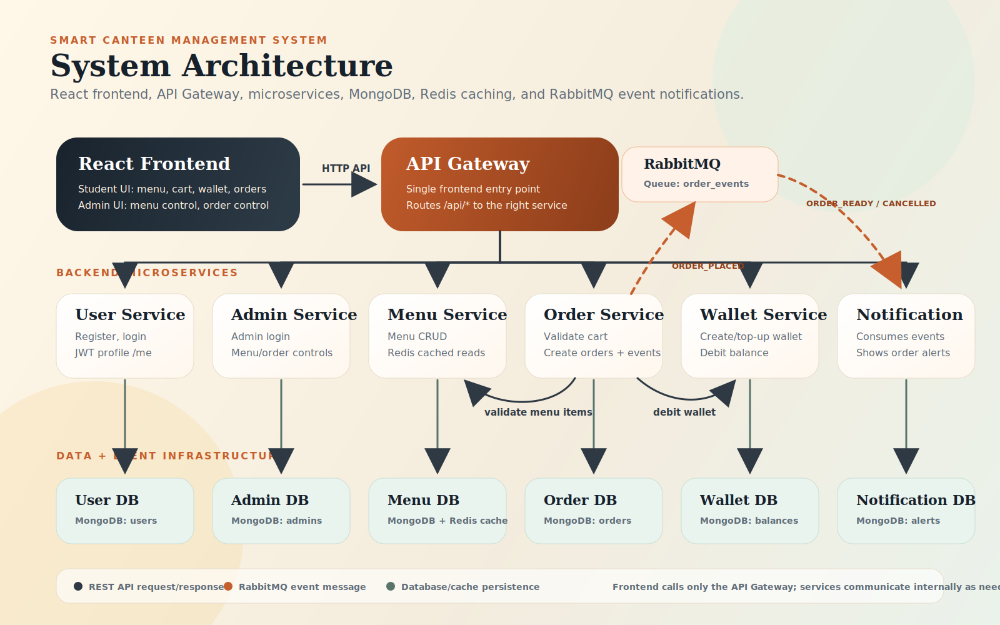

# Smart Canteen Management System

A full-stack canteen ordering platform built with a React frontend, an API gateway, and seven Node.js microservices. Students can register, log in, browse menu items, add items to a cart, manage a wallet, place orders, and view notifications. Admins can manage menu items and update order statuses from a role-based dashboard.

## Architecture



The frontend talks to the backend only through the API gateway on port `5000`. The gateway forwards requests to the correct service, while the order service also communicates with menu and wallet services internally. RabbitMQ is used for asynchronous order notifications, Redis is used for menu caching, and MongoDB stores service data.

## Services

| Service | Port | Responsibility |
| --- | --- | --- |
| Frontend | `5173` | React UI for student and admin workflows |
| API Gateway | `5000` | Single backend entry point for the frontend |
| Order Service | `5001` | Creates orders, validates items, debits wallet, publishes events |
| Menu Service | `5002` | Stores and serves menu items with Redis caching |
| User Service | `5003` | Student registration, login, JWT auth, profile API |
| Admin Service | `5004` | Admin login, menu controls, order status controls |
| Wallet Service | `5005` | Wallet creation, balance lookup, atomic debit |
| Notification Service | `5006` | Consumes RabbitMQ events and exposes notification APIs |

## Main Features

- Student authentication with JWT-protected routes.
- Menu browsing with item detail lookup before adding to cart.
- Cart management in frontend `localStorage`.
- Wallet creation and payment debit during order placement.
- Order placement through the order service.
- RabbitMQ-based notification creation after order events.
- Admin dashboard for menu CRUD and order status updates.
- API gateway routing for all frontend-to-backend communication.

## Tech Stack

- Frontend: React, Vite, React Router, Axios
- Backend: Node.js, Express.js
- Databases: MongoDB per service
- Messaging: RabbitMQ
- Caching: Redis
- Auth: JWT
- Tooling: Docker Compose, npm, Git

## Local Setup

### 1. Start Infrastructure

Make sure Docker Desktop is running, then start MongoDB, Redis, and RabbitMQ:

```bash
docker compose up -d
```

RabbitMQ management UI is available at `http://localhost:15672`.

### 2. Configure Environment Files

Copy each example file to `.env`:

```bash
copy .env.example .env
copy frontend\.env.example frontend\.env
copy services\api-gateway\.env.example services\api-gateway\.env
copy services\user-service\.env.example services\user-service\.env
copy services\menu-service\.env.example services\menu-service\.env
copy services\order-service\.env.example services\order-service\.env
copy services\wallet-service\.env.example services\wallet-service\.env
copy services\notification-service\.env.example services\notification-service\.env
copy services\admin-service\.env.example services\admin-service\.env
```

Use the same `JWT_SECRET` value across all services that create or verify tokens. The example secret is for local development only.

### 3. Install Dependencies

Run this once in each service and in the frontend:

```bash
cd services\api-gateway && npm install
cd ..\user-service && npm install
cd ..\menu-service && npm install
cd ..\order-service && npm install
cd ..\wallet-service && npm install
cd ..\notification-service && npm install
cd ..\admin-service && npm install
cd ..\..\frontend && npm install
```

### 4. Run Backend Services

Open separate terminals and run:

```bash
cd services\user-service && npm start
cd services\menu-service && npm start
cd services\wallet-service && npm start
cd services\order-service && npm start
cd services\notification-service && npm start
cd services\admin-service && npm start
cd services\api-gateway && npm start
```

### 5. Run Frontend

```bash
cd frontend
npm run dev
```

Open `http://localhost:5173`.

## Demo Accounts

Student accounts can be created from the registration page.

Development admin account:

```text
Email: admin@smartcanteen.com
Password: Admin@123
```

Use the role tabs on the login page to switch between Student and Admin login.

## API Entry Point

All frontend API calls go through:

```text
http://localhost:5000
```

Important gateway routes:

- `/api/auth`
- `/api/users`
- `/api/menu`
- `/api/orders`
- `/api/wallet`
- `/api/notifications`
- `/api/admin`

Detailed endpoints are documented in [docs/api-contracts.md](docs/api-contracts.md).

## Documentation

- [Architecture](docs/architecture.md)
- [API and event contracts](docs/api-contracts.md)
- [Workflow](docs/workflow.md)
- [Frontend guide](frontend/README.md)
